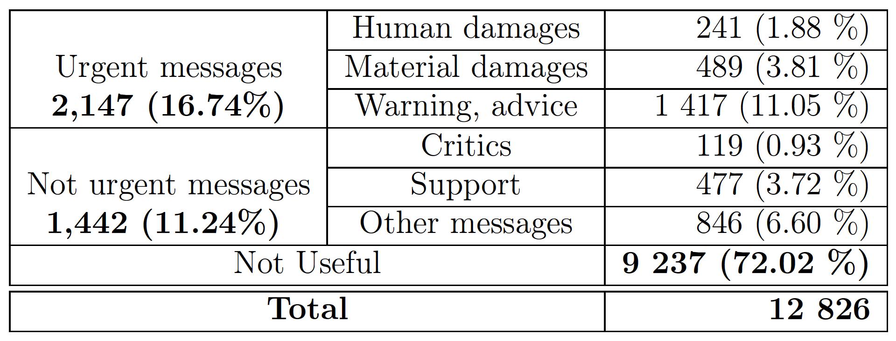
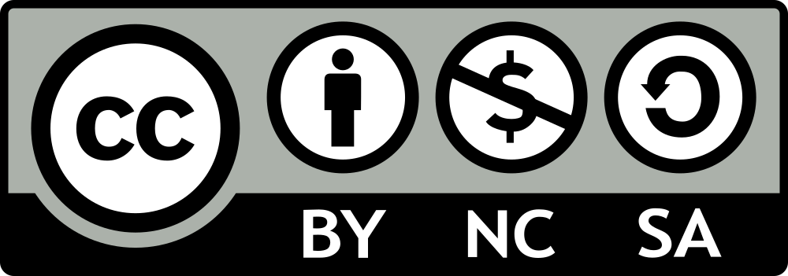

## Dataset description

This repository contains the first crisis-related dataset for French, developed at IRIT-Toulouse University and IJN-. The dataset is about 13 ecological crises that occured in metropolitan France and its overseas departments targeting the most discussed crises in the French media from 2016 to 2019: two floods that occured in the Aude and Corsica regions, ten storms (Béryl, Berguitta, Fionn, Eleanor, Bruno, Egon, Ulrika, Susanna, Fakir and Ana), two hurricanes (Irma and Harvey) 

It is composed of around 13k tweets  posted before (24h before), during (48h) and after the crisis (72h after). Each message has been annotated according to three dimensions: relatedness (useful vs. non useful), urgency (non useful vs. urgent vs. non urgent), and intentions to act (6 categories among: human/material damages, warnings/advices, critics, etc.).


The distribution of the tweets in the dataset is as follows: 



## Repository structure

The dataset is in csv format, each line contains: 

tweetID crisisname period relatedness_annotation urgency_annotation intention_annotation

where:
- tweetID: unique Tweet ID
- crisisname: the name of the crisis
- period: before (24h before), during (48h) and after the crisis (72h after).
- relatedness_annotation: useful vs. non useful
- urgency_annotation: urgent, non urgent, non useful
- intention_annotation: Human damages, Material damages, Warning-advice, Support, Critics, Other messages.


To obtain the individual tweets, use the Twitter API of your choice and query for the ID's provided.

## Reference

More information about the dataset and the guidelines can be found in the following article:


Diego Kozlowski, Elisa Lannelongue, Frédéric Saudemont, Farah Benamara, Alda Mari, Véronique Moriceau, Abdelmoumene Boumadane (2020). A three-level classification of French tweets in ecological crises. Information Processing & Management, Volume 57, Issue 5, 2020.


If you use any of the provided material in your work, please cite us as follows


```
@article{Kozlowski-et-al2020,
title = "A three-level classification of French tweets in ecological crises",
journal = "Information Processing & Management",
volume = "57",
number = "5",
pages = "102284",
year = "2020",
issn = "0306-4573",
doi = "https://doi.org/10.1016/j.ipm.2020.102284",
url = "http://www.sciencedirect.com/science/article/pii/S0306457320300650",
author = "Diego Kozlowski and Elisa Lannelongue and Frédéric Saudemont and Farah Benamara and Alda Mari and Véronique Moriceau and Abdelmoumene Boumadane",
keywords = "Crisis response from social media, Machine learning, Natural language processing, Transfer learning",
}

```


### Licence



This work is licensed under a [Creative Commons Attribution-NonCommercial-ShareAlike 4.0 International License](https://creativecommons.org/licenses/by-nc-sa/4.0/). 

### Contact information
If you have any question or suggestion, do not hesitate to contact us at the following addresses:
- Farah Benamara ([farah DOT benamara AT irit DOT fr](mailto:farah.benamara@irit.fr))
- Alda Mari (alda.mari AT ens DOT fr)


